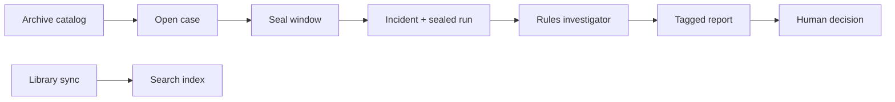

<p align="center">
  
</p>

<h1 align="center">ORBIT</h1>

<p align="center">
  Investigation workbench for spacecraft anomaly response.<br />
  Assembles sealed telemetry, procedures, and priors — then stops at a human decision.
</p>

<p align="center">
  <a href="#quick-start">Quick start</a> ·
  <a href="#demo-walkthrough">Demo</a> ·
  <a href="#architecture">Architecture</a> ·
  <a href="#evaluation">Evaluation</a>
</p>

---

## Overview

ORBIT helps operators investigate alarms they already have. It does **not** detect anomalies and does **not** command the spacecraft.

Given an alarm, a time, and an upstream archive tape, ORBIT:

1. **Seals** a time window of telemetry and events into a durable evidence package
2. **Runs** a deterministic investigation against procedures and prior close-outs
3. **Tags** every claim with how it was sourced (observed, derived, documented, hypothesis)
4. **Recommends** a human action — without uplinking anything

The browser console uses the rules-based investigator only (`--provider rules`). Paid LLM providers are available via CLI for experimentation, not in the HTTP investigate path.

**Demo spacecraft:** Aurora-1 · **Suggested path:** `INC-0205` → `INC-0210` → Trust eval scorecard

## Table of contents

- [Overview](#overview)
- [What ORBIT is not](#what-orbit-is-not)
- [Quick start](#quick-start)
- [Demo walkthrough](#demo-walkthrough)
- [Console](#console)
- [Investigation model](#investigation-model)
- [Architecture](#architecture)
- [Project structure](#project-structure)
- [CLI reference](#cli-reference)
- [Evaluation](#evaluation)
- [Configuration](#configuration)
- [Development](#development)

## What ORBIT is not

| | |
|---|---|
| Anomaly detection | Operators bring the alarm; ORBIT assembles evidence |
| Live downlink | Evidence is fetched from an archive catalog and sealed locally |
| Command uplink | Filing records a close-out; ORBIT never sends spacecraft commands |
| Mission archive of record | ORBIT stores sealed windows, not full-orbit telemetry history |

## Quick start

### Prerequisites

- Python 3.11+
- Docker (Postgres 16 + pgvector)

### Install and run

```bash
git clone https://github.com/pchung39/orbit.git
cd orbit

python -m venv .venv
source .venv/bin/activate
pip install -r requirements.txt

docker compose up -d
python -m storage ingest

uvicorn api.app:app --host 127.0.0.1 --port 8000 --reload
```

### Open the app

| URL | Purpose |
|---|---|
| [http://127.0.0.1:8000/](http://127.0.0.1:8000/) | Landing page |
| [http://127.0.0.1:8000/app](http://127.0.0.1:8000/app) | Operator console |
| [http://127.0.0.1:8000/app/incidents/INC-0205](http://127.0.0.1:8000/app/incidents/INC-0205) | Sample case (direct) |
| `GET /health` | Health probe (`/api/health` also works) |

Default database credentials are in `docker-compose.yml` (`orbit` / `orbit`). They are for local development only.

Optional API keys (`.env`, not committed): `ANTHROPIC_API_KEY`, `OPENAI_API_KEY` for CLI investigation only.

## Demo walkthrough

Follow the overview walkthrough in the app, or open these cases directly:

| Step | Case | What to notice |
|---|---|---|
| 1 | **INC-0205** | Heater-only fault — clear inhibit recommendation |
| 2 | **INC-0210** | Same alarm signature, payload is the culprit — do not inhibit the heater |
| 3 | **Trust → Eval** | Release scorecard matches `python -m eval` output |

Additional scenarios:

| Case | Tape | Lesson |
|---|---|---|
| INC-0204 | eps204 | Heater fault + SCIENCE_MODE confounder |
| INC-0212 | marg001 | Loads below ≥2× bar → hold, do not command |
| INC-0211 | batt003 | Pack IR sag; healthy load currents |

## Console

The desk is a single-page app served from `/app`.

| View | Route | Description |
|---|---|---|
| **Overview** | `/app` | Mission context, product brief, desk queue |
| **Incidents** | `/app/incidents` | Searchable case log grouped by source tape |
| **Case** | `/app/incidents/{id}` | Investigation, knowledge, procedure, evidence, decision |
| **Trust** | `/app/trust` | Data sources, store health, eval scorecard, tape inspector |

**Open case** collects an alarm channel, alarm time, and upstream archive tape. ORBIT fetches a window (warn ± padding) and materializes a `sealed_*` run in Postgres. Pre-seeded demo incidents skip this step.

JSON API lives under `/api`. Static assets under `/static`.

## Investigation model

### Source tags

Every claim in an investigation report is stamped with a provenance tag:

| Tag | Meaning |
|---|---|
| **OBSERVED** | Directly in telemetry or the command log |
| **DERIVED** | Computed from telemetry (e.g. load ratio vs healthy draw) |
| **DOCUMENTED** | From a procedure step or prior close-out |
| **HYPOTHESIS** | Proposed cause — not yet proven |

A plausible narrative is not a root cause until the procedure threshold is met (e.g. EPS-17 step 4: load ≥2× healthy ON).

### Operator feedback

On a recommended case, operators can confirm or reject ORBIT's working hypothesis (or hold decision) before filing. Feedback is stored with the incident and appended to the close-out. It does not change uplink behavior.

### Product thesis

> Last command is not automatically the cause.

Heater B draws ~1.2 A when healthy. A fault draws ~3.7 A. Two minutes later the payload enters SCIENCE_MODE. Bus voltage crosses 26.5 V. The payload looks guilty — but the heater was already wrong. ORBIT walks the procedure, tags the evidence, and recommends inhibiting Heater B without sending the command.

## Architecture

ORBIT is an investigation workbench, not the mission archive.

```
Upstream archive          ORBIT                         Operator
─────────────────         ─────                         ────────
Full scenario tapes  →    Seal window (sealed_* run)
Procedures & priors    →    Postgres + pgvector    →    Console / API
                          Rules investigator
                          Eval harness
```

Interactive diagram: [`docs/architecture.html`](docs/architecture.html)



**Trust → Sources** shows the archive catalog (upstream) and library index (embeddings rebuilt on sync). Opening a case fetches from the archive; ORBIT never requires uploading a CSV per incident.

## Project structure

The mission spec is canonical: [`spec/aurora1_mission_model.yaml`](spec/aurora1_mission_model.yaml). If code and spec disagree, the spec wins.

```
orbit/
├── spec/                 Mission model — channels, limits, faults, scenarios
├── simulator/            Physics engine and scenario CSV generation
├── storage/              Postgres ingest, query, embeddings, seal windows
├── agent/                Investigator (rules | claude | openai) + tools
├── api/                  FastAPI server and static console routes
├── ui/                   Desk SPA (overview, incidents, case, trust)
├── eval/                 Scorecard, baseline comparison, release gate
├── procedures/           EPS-17, PAY-04, EPS-09
├── incidents/            Closed prior close-outs (INC-0187, …)
├── runs/                 Generated scenario CSVs (archive source)
└── docs/                 Architecture poster, screenshots, assets
```

| Component | Role |
|---|---|
| **Spec** | Channel definitions, warn limits, fault library, demo scripts |
| **Simulator** | Nominal, EPS-204, fault1, pay002, batt003, marg001, priors |
| **Store** | Runs, telemetry, events, documents, incidents, feedback |
| **Agent** | Tool-using investigator; rules provider for console/API |
| **Console** | Case workflow UI with investigation, evidence, and filing |
| **Eval** | Diagnosis accuracy, withhold correctness, false-inhibit checks |

## CLI reference

### Storage

```bash
python -m storage ingest                          # Load schema, tapes, docs, demo incidents
python -m storage channel eps204 THM.heater_b_current --from-clock 14:29:00 --to-clock 14:33:00
python -m storage events eps204
```

### Simulator

```bash
python -m simulator --validate-only
python -m simulator --scenario eps204 --out runs/eps204.csv
```

### Investigation (CLI)

```bash
python -m agent investigate eps204 --provider rules     # Deterministic, no API key
python -m agent investigate eps204                      # Claude, if ANTHROPIC_API_KEY is set
```

The HTTP `POST /api/incidents/{id}/investigate` route always uses rules.

### Tape inspector (HTTP)

```
GET /api/runs/{run_id}/inspect?channel=THM.heater_b_current&alarm=EPS.bus_voltage&window=focus
```

Also available in the UI: **Trust → Inspect**, or **Inspect samples** on Case → Tape.

## Evaluation

The eval harness scores finished investigation reports against known close-outs and prints release metrics.

| Metric | What it measures |
|---|---|
| **Named closes correct** | Heater / payload / battery cases fully passed |
| **Withheld when bar not met** | Decoy case refused to invent a root cause |
| **No false Heater B inhibit** | Contrast cases correctly leave the heater alone |
| **Source tags** | Provenance tags present; OBSERVED kept separate from HYPOTHESIS |

```bash
python -m eval                              # Run suite → eval/scorecard.json
python -m eval --scorecard-only
python -m eval --compare-only               # Compare vs eval/baseline.json
python -m eval --compare-baseline           # Full run + compare
python -m eval --promote-baseline           # Promote candidate after PASS

python -m unittest eval.test_release_gate eval.test_explorer -v
```

**Release gate:** Trust Eval Explorer reads `eval/scorecard.json` and compares against `eval/baseline.json` (`PASS`, `BLOCKED`, or `INSUFFICIENT_COVERAGE`). A passing candidate does not overwrite the baseline automatically — promotion is explicit.

**Eval Explorer API:** `GET /api/eval/explorer`, `GET /api/eval/cases/{id}`

**Current rules scorecard:** 4/4 named closes · 1/1 withheld · 3/3 no false Heater B inhibit · 5/5 fact vs inference clean

```bash
python -m eval --feedback                   # Summarize operator hypothesis feedback
python -m eval --feedback --export
```

## Configuration

| Variable | Purpose |
|---|---|
| `ANTHROPIC_API_KEY` | CLI investigation with Claude (optional) |
| `OPENAI_API_KEY` | CLI investigation with OpenAI (optional) |
| `LANGSMITH_API_KEY` | Trace investigations to LangSmith (optional) |
| `LANGSMITH_TRACING` | Set `true` to enable LangSmith |
| `LANGSMITH_PROJECT` | LangSmith project name (default: ORBIT) |
| `BRAINTRUST_API_KEY` | Braintrust tracing fallback if LangSmith key absent |

Do not commit `.env`, `.env.langsmith`, or `.env.braintrust`.

Traced paths when enabled: console investigate, `python -m agent investigate`, and `python -m eval` case runs. No tracing keys → no-op.

## Development

### Regenerate screenshots

With the server running:

```bash
pip install playwright
playwright install chromium
python docs/capture_screenshots.py
```

Output goes to `docs/screenshots/`.

### Key API routes

| Method | Path | Description |
|---|---|---|
| `GET` | `/api/incidents` | List incidents |
| `POST` | `/api/incidents` | Open case (alarm + tape → seal) |
| `GET` | `/api/incidents/{id}/workspace` | Telemetry, events, channels for a case |
| `POST` | `/api/incidents/{id}/investigate` | Run rules investigation |
| `POST` | `/api/incidents/{id}/file` | File close-out |
| `GET` | `/api/trust` | Store health, library, eval snapshot |
| `GET` | `/api/eval/explorer` | Eval suite index |

---

<p align="center">
  <sub>ORBIT · Aurora-1 · investigation workbench demo</sub>
</p>
