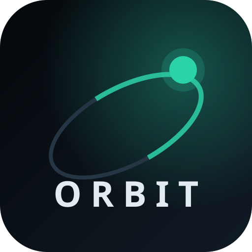
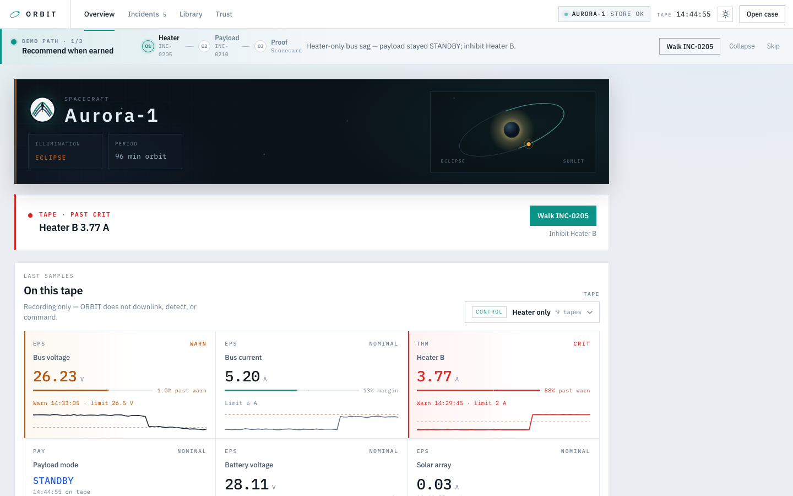
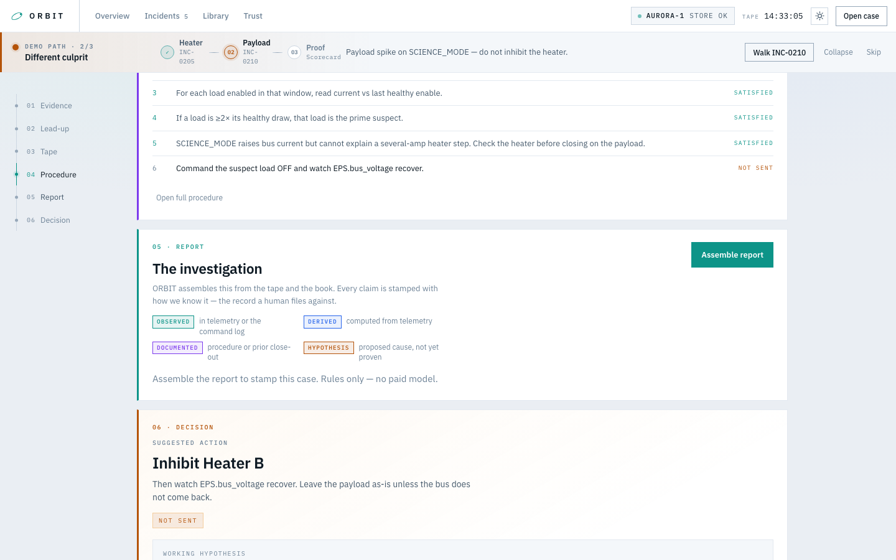
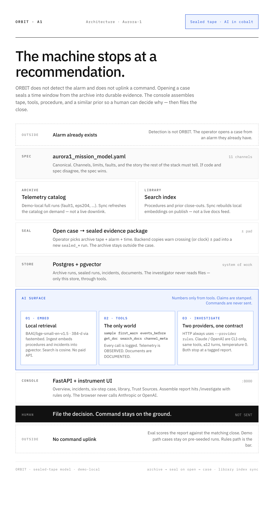
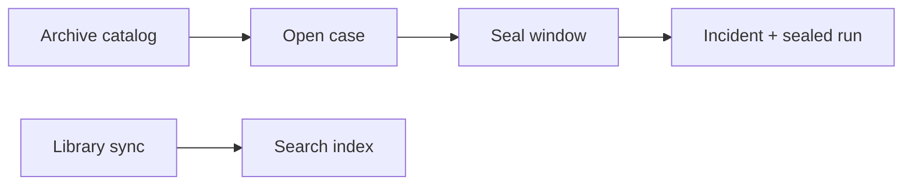
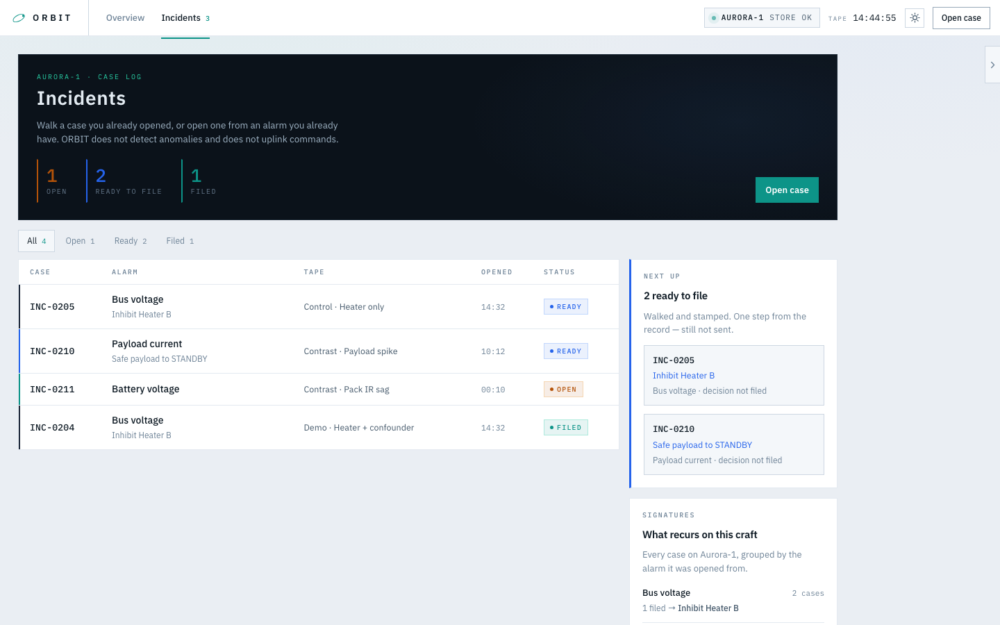
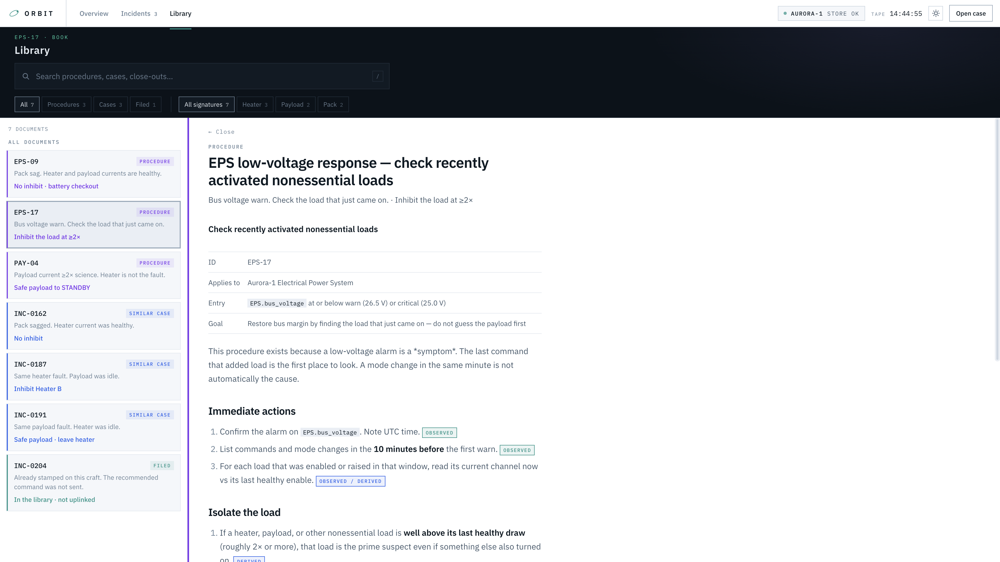
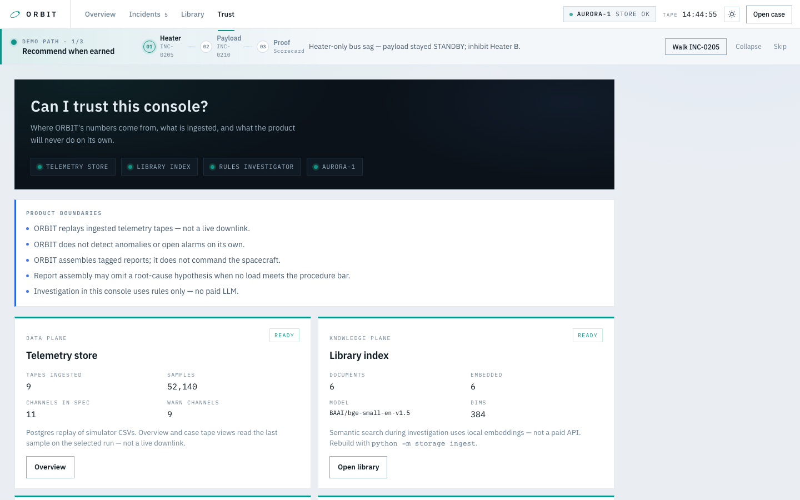
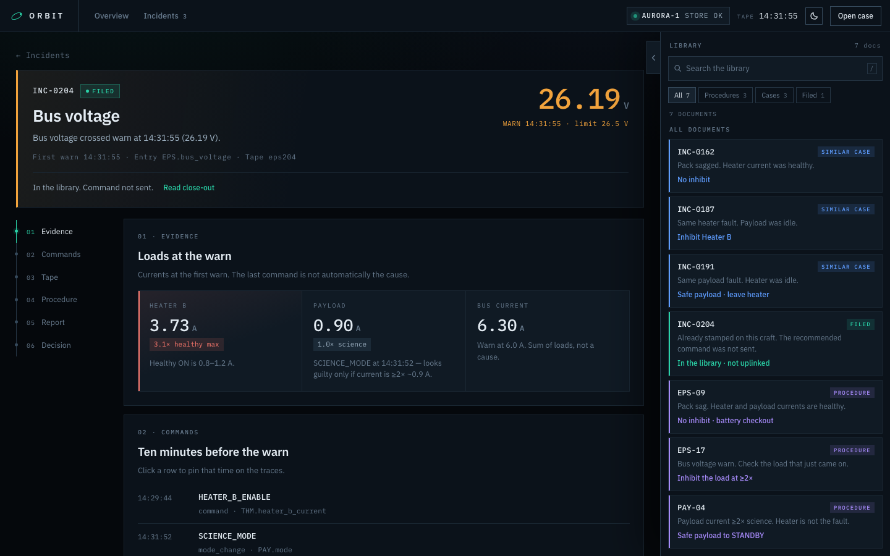

<p align="center">
  
</p>

<h1 align="center">ORBIT</h1>

<p align="center">
  <strong>An operator already has an alarm.</strong><br />
  ORBIT assembles the tape, the last commands, the procedure, and a similar prior<br />
  so a human can decide why — then it stops.
</p>

<p align="center">
  
</p>

<p align="center">
  <em>Demo spacecraft: <strong>Aurora-1</strong> · In-product path: <strong>INC-0205</strong> → <strong>INC-0210</strong> → <strong>Trust</strong></em>
</p>

---

ORBIT does **not** detect anomalies. It does **not** command the spacecraft.

It starts after detection and stops at a human decision. Filing records the close; it still does not uplink.

The browser investigator is deterministic (`--provider rules`). No paid model in the console.

## Why it exists

Last command is not automatically the cause.

Healthy Heater B draws ~1.2 A when ON. The fault draws ~3.7 A — about 3×. Two minutes later the payload enters `SCIENCE_MODE`. Bus voltage nips 26.5 V. Bus current hits 6 A. The payload looks guilty.

**The heater was already wrong.**

ORBIT recommends inhibit Heater B — and still does not send the command.

That confounder is the product thesis: evidence assembly with provenance, not vibes and not uplink.

## Demo path (90 seconds)

The console ships a collapsible **Demo path** rail. Follow it cold:

| Step | Open | What you should see |
|---|---|---|
| **01 Heater** | **INC-0205** | Heater only — no payload confounder. Clear close. |
| **02 Payload** | **INC-0210** | Payload is guilty. Do **not** inhibit Heater B. |
| **03 Proof** | **Trust → Eval scorecard** | Same rates `python -m eval` writes to disk. |

Encore if you have time:

- **INC-0204** — heater fault + science-mode confounder (the story above)
- **INC-0212** — same shape, loads below the ≥2× bar → **Hold — do not command**
- **INC-0211** — pack IR sag; leave the loads alone

<p align="center">
  
</p>

## The investigation

Step **01** is the product moment. Run investigation to stamp a report from the tape and the book. Every claim is tagged:

| Tag | Meaning |
|---|---|
| **OBSERVED** | In telemetry or the command log |
| **DERIVED** | Computed from telemetry |
| **DOCUMENTED** | Procedure or prior close-out |
| **HYPOTHESIS** | Proposed cause — not yet proven |

A plausible story is not a cause until the procedure’s number is met. On **INC-0212** (`marg001`), ORBIT finishes the bookkeeping, refuses to invent a FAULT id, and recommends **Hold — do not command**.

## What you get

1. **Overview** — mission badge, tape handoff, last samples, orbit context, limit-margin meters
2. **Incidents** — case queue, craft signatures, next-up ordering
3. **Case** — investigation-first walkthrough: **Run investigation** → **Knowledge** (grounded procedure + priors) → procedure → evidence → decision
4. **Trust** — **Sources** (telemetry archive + library index), store health, eval scorecard, tape inspect
5. **Demo path** — collapsible guided tour that ends on proof, not prose

**Open case** asks for an alarm, time, and **archive tape**. ORBIT **seals a time window** (warn ± pad) into a new evidence package for that case — it does not keep a live downlink. Demo path incidents (`INC-0205`, `0210`, …) are pre-seeded and unchanged.

## Architecture (sealed tape)

<p align="center">
  
</p>

Interactive poster: open [`docs/architecture.html`](docs/architecture.html) in a browser.



ORBIT is an investigation workbench, not the mission archive. Upstream (demo-local here) holds full tapes and docs; opening a case materializes a **sealed** telemetry window; Library sync rebuilds the **search index**.

<p align="center">
  
</p>

<p align="center">
  
</p>

<p align="center">
  
</p>

## Console (v0.6)

| View | What it shows |
|---|---|
| **Overview** | Mission badge, Demo path, tape handoff, channel tiles + sparklines, orbit map |
| **Incidents** | Filterable table, stats, **Next up**, **Signatures**; **Open case** = alarm + time + archive tape → sealed package |
| **Case** | Investigation hero, contextual knowledge (grounded procedure + priors + search), collapsible procedure & evidence, file decision |
| **Trust** | **Sources** (Telemetry archive + Library index; on-demand sync), archive/sealed catalog, scorecard, Inspect |
| **Theme** | Dark default, light optional |

<p align="center">
  
</p>

## Run the demo

Python 3.11+ and Docker (Postgres + pgvector).

```bash
python -m venv .venv
source .venv/bin/activate
pip install -r requirements.txt

docker compose up -d
python -m storage ingest

uvicorn api.app:app --host 127.0.0.1 --port 8000 --reload
```

Open [http://127.0.0.1:8000/](http://127.0.0.1:8000/).

**Start here:** follow the in-product **Demo path** (INC-0205 → INC-0210 → Trust scorecard).

**Sources (Trust):** Telemetry **archive** and **Library index** connectors. Sync refreshes the archive catalog or rebuilds embeddings on demand (not a live feed). Opening a case seals a time window from an archive tape into a durable `sealed_…` run for that incident.

Local DB is `orbit` / `orbit` in `docker-compose.yml` — not a production secret. `.env` is for optional CLI keys only; do not commit it.

### Peek at raw telemetry

**Tape inspector** (UI): **Trust → Inspect**, or **Inspect samples** on Case → Tape.

```bash
python -m storage channel eps204 THM.heater_b_current --from-clock 14:29:00 --to-clock 14:33:00
python -m storage events eps204
```

HTTP: `GET /runs/{run_id}/inspect?channel=&alarm=&window=focus|full`

### Regenerate screenshots

With the server running:

```bash
pip install playwright
playwright install chromium
python docs/capture_screenshots.py
```

## Eval

Scores a finished report against the matching close, then prints real rates:

| Metric | Meaning |
|---|---|
| **Named closes correct** | Heater / payload / battery cases fully passed |
| **Withheld when bar not met** | Decoy (`marg001`) refused to invent a cause |
| **No false Heater B inhibit** | Contrast cases that correctly leave the heater alone |
| **Fact vs inference clean** | Tags present; timeline OBSERVED kept separate from causal HYPOTHESIS |

```bash
python -m eval                 # run suite, write eval/scorecard.json
python -m eval --scorecard-only
```

Default is `--provider rules` (no paid LLM). Green on this harness is the bar: **5 cases** (four closes + one withheld). Trust reads `eval/scorecard.json` so the console shows the same numbers.

**Current rules scorecard:** 4/4 named closes · 1/1 withheld · 3/3 no false Heater B inhibit · 5/5 fact vs inference clean.

### Braintrust (optional)

If `BRAINTRUST_API_KEY` is set (via `.env.braintrust` from the Braintrust wizard, or env), ORBIT sends investigation traces to project **ORBIT**:

- Console / API **Run investigation** (rules + tool spans)
- `python -m agent investigate … --provider rules` (and LLM CLI when wrapped)
- `python -m eval` case runs

No key → tracing is a no-op. Do not commit `.env.braintrust` or `.braintrust.json`.

### Operator hypothesis feedback

On **Case**, confirm or reject ORBIT’s recommendation — the working hypothesis when one was asserted, or the hold decision when threshold was not met. Feedback is stored until file, appended to the close-out, and never changes uplink behavior.

```bash
python -m eval --feedback
python -m eval --feedback --export
```

## How it's built

The spec is canonical: [`spec/aurora1_mission_model.yaml`](spec/aurora1_mission_model.yaml). If code and spec disagree, the spec wins.

| Piece | Role |
|---|---|
| Spec | Channels, limits, faults — the story the stack must tell |
| Simulator | Nominal + EPS-204 + fault1 + INC-0187 + PAY-002 + INC-0191 + BATT-003 + INC-0162 + marg001 |
| Store | Postgres / pgvector — runs, telemetry, events, procedures, incidents |
| Agent | Tools over the store; `--provider rules` in the UI; Claude/OpenAI CLI-only |
| Console | FastAPI + instrument UI at `/` |
| Trust API | `GET /trust` — store, library, investigator health |
| Eval | Diagnosis / withhold / false-inhibit / provenance scorecard |
| Feedback | Operator confirm/reject on working hypothesis |

```
spec/aurora1_mission_model.yaml
simulator/          physics + scenarios
storage/            ingest, query, local embeddings, trust snapshot, sources, seal windows
agent/              investigate (rules | claude | openai)
api/                HTTP + static console
ui/                 overview, incidents, case, library, trust, demo path, sources
procedures/         EPS-17, PAY-04, EPS-09
incidents/          closed priors (INC-0187, INC-0191, INC-0162, …)
eval/
```

## Optional: simulator and LLM CLI

```bash
python -m simulator --validate-only
python -m simulator --scenario eps204 --out runs/eps204.csv
python -m agent investigate eps204 --provider rules
python -m agent investigate eps204              # Claude, if ANTHROPIC_API_KEY is set
```

Paid models are CLI-only. The HTTP investigate route always uses rules — it will not call Anthropic or OpenAI.

## Not this

- Anomaly detection or a live vehicle
- Command uplink

---

<p align="center">
  
  &nbsp; ORBIT · Aurora-1 · v0.6
</p>
